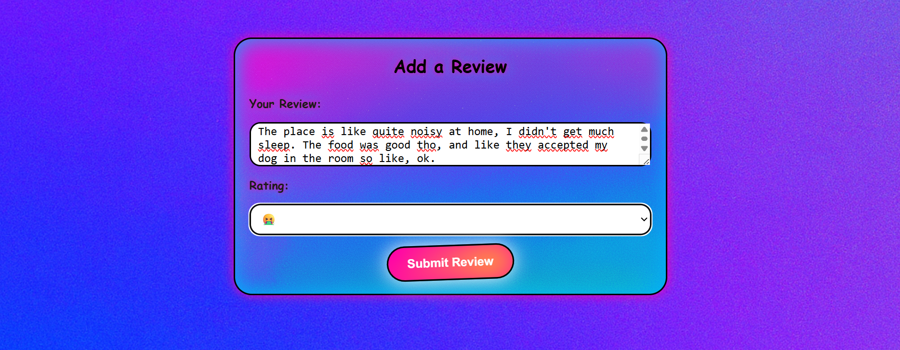
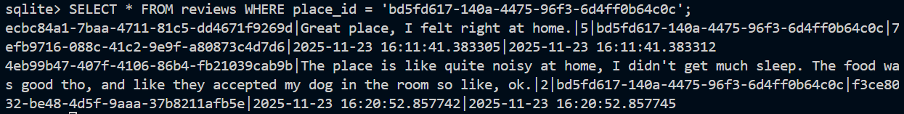
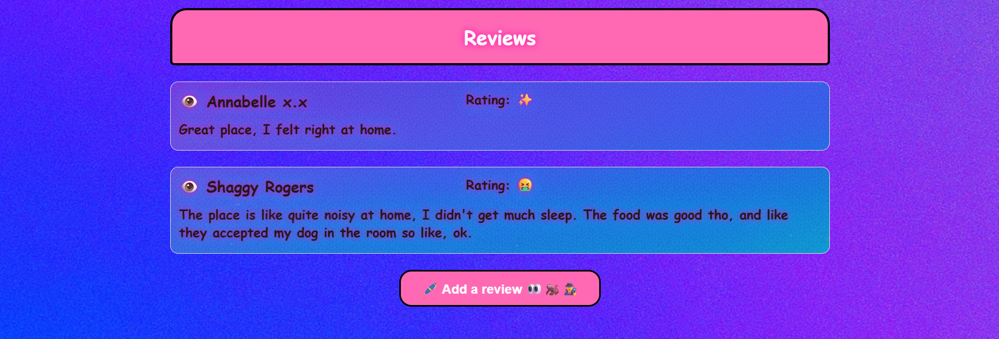
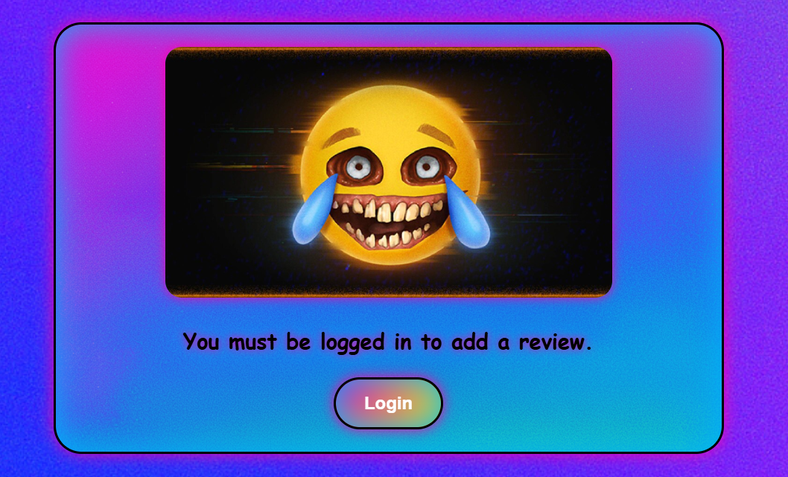
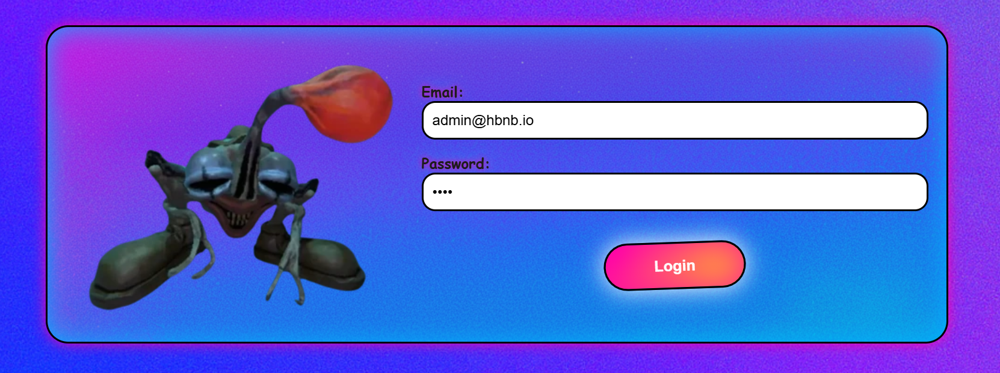

# Hbnb - Part2 : Simple Web Client

## Overview
1. [Intro](#intro)
2. [Structure](#structure)
3. [AD](#AD)
4. [Tests examples](#tests-examples)

## Intro
This part is dedicated to the front part of the project. If you haven't read the explanation about the previous part, I suggest you start with that.
- [The architecture](https://github.com/sarahwcqz/holbertonschool-hbnb/tree/develop/part1)
- [The Business Logic and APIs](https://github.com/sarahwcqz/holbertonschool-hbnb/tree/develop/part2)
- [Authentication and Database](https://github.com/sarahwcqz/holbertonschool-hbnb/tree/develop/part3)
This part is no longer a group project, for this one we will be on our own.
(By the way, thank you [Mustapha](https://github.com/stafach), it was great working with you!)
Some parts of this task were required but for most of them we were free to do as we please, this includes the CSS.

**To run the program:**
- the back server : in part4/back => `python3 run.py`
- the front server : in part4/front => `python3 -m http.server 5500`

## Structure
### Objectives
- Develop a user-friendly interface following provided design specifications.
- Implement client-side functionality to interact with the back-end API.
- Ensure secure and efficient data handling using JavaScript.
- Apply modern web development practices to create a dynamic web application.

### Learning Goals
- Understand and apply HTML5, CSS3, and JavaScript ES6 in a real-world project.
- Learn to interact with back-end services using AJAX/Fetch API.
- Implement authentication mechanisms and manage user sessions.
- Use client-side scripting to enhance user experience without page reloads.

### Tasks Breakdown
1. Design
Complete provided HTML and CSS files to match the given design specifications.
Create pages for Login, List of Places, Place Details, and Add Review.

2. Login
Implement login functionality using the back-end API.
Store the JWT token returned by the API in a cookie for session management.

3. List of Places
Implement the main page to display a list of all places.
Fetch places data from the API and implement client-side filtering based on country selection.
Ensure the page redirects to the login page if the user is not authenticated.

4. Place Details
Implement the detailed view of a place.
Fetch place details from the API using the place ID.
Provide access to the add review form if the user is authenticated.

5. Add Review
Implement the form to add a review for a place.
Ensure the form is accessible only to authenticated users, redirecting others to the index page.

## AD
### Identity
For the visual part of the project I wanted something very Y2K, with a lot of glitter, flashing colors and emojis all over, but also cringe and weird, with disturbing emojis and images. I got a lot of inspiration from the video game [R.E.P.O](https://store.steampowered.com/app/3241660/REPO/), which is in this spirit.

### Colors

  

 #ff00aa
  

 #00b2ff
  

 #F8C908
  

 #00FF7F
  

 #000000

### Music
I decided to add some music to the project because it's an important part of my personality.
I added 5 tracks, that represent most of the playlist I was listening to when writing this part of the code.
- [Quilting - Brandsky](https://soundcloud.com/melopeerecords/brandski-quilting-original-mix?si=cb342df5d81f45f7975f9af4aaff497f&utm_source=clipboard&utm_medium=text&utm_campaign=social_sharing)
- [Not My Mind, Not My Planet - Rhode & Brown](https://www.youtube.com/watch?v=_FJO4P-fxe4&list=RD_FJO4P-fxe4&start_radio=1)
- [Prisoner Of Love - Biesmans & Vandesande](https://www.youtube.com/watch?v=WGDtRzLDZMM&list=RDWGDtRzLDZMM&start_radio=1)
- [Therapy - Mouissie](https://www.youtube.com/watch?v=cUGbUY8zTzc&list=RDcUGbUY8zTzc&start_radio=1)
- [Cosmic Renegade - Vitalic](https://www.youtube.com/watch?v=Mis0A-ZAVwM&list=RDMis0A-ZAVwM&start_radio=1)(my personnal favorite)
This style is called italodisco and I think it goes well with the personnality of the website since I see it as some kind of intergalactict surf, very 2000s and quite unreal.

### The users
#### Places
- Baron Von Porcelain :
He has a creepy house full of Dolls.

- The Lovebirds :
They just can't stop PDAing. Awkward.

- Thierry :
He is a lover. A bit too clingy is all.

- Sandrine :
She's had enough.

Those are based on true Airbnb stories.

#### Reviews
- Shaggy : from the tv show Scooby-Doo
- Annabelle : from the horror movie Annabelle
- Sheldon : from the TV show The Big Bang Theory
- Dwight : from the TV show The Office
- Trump : I bet you all know this one.

## Tests examples
I did most of the tests directly from the webpage, checking in the same time in the DB that everything was added correctly.

### Post a review
- For example, I tried to log in as Shaggy Rogers, and to post a review for the Doll House from the website.

- First let's check that it is correctly added to the DB;

- Now we can see it on the webpage.

- If you are not logged in as a user, you'll see this message:

- On the same principle, if you are not logged, you won't have acces to the main content, and you'll see a message inviting you to login.

- The page to log in checks if you're credentials are valid, and if so, redirects you to the main page, with the places available.
